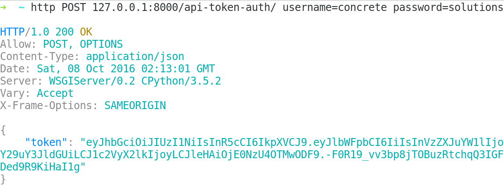

# restful-experiment
Restful API for user registration and login. Python, DRF, JWT. Use it on Heroku at [Restful Experiment](https://restful-experiment.herokuapp.com/).



## Getting Started

### Registering an user

```
$ curl -X POST -H "Content-Type: application/json" -d '{"name":"concrete", "email": "john@doe.com", "password":"solutions", "phones": [{ "number": "987654321", "ddd": "21" }]}' http://restful-experiment.herokuapp.com/cadastro/
```

### Login 

### User's Profile

### Getting token for a registered user

```
$ curl -X POST -H "Content-Type: application/json" -d '{"username":"concrete","password":"solutions"}' http://restful-experiment.herokuapp.com/api-token-auth/
```

Now in order to access protected api urls you must include the Authorization: JWT <your_token> header.

## Contributing

## Installing

```
$ git clone git@github.com:GuidoBR/restful-experiment.git
$ virtualenv venv && source venv/bin/activate
$ pip install -r requirements.txt
```

To run locally, use django command:

```
$ python manage.py runserver
```

### Tests

Run the project's tests.

```
$ python manage.py test
```

## License

This project is licensed under the MIT License - see the [LICENSE.md](LICENSE) file for details
